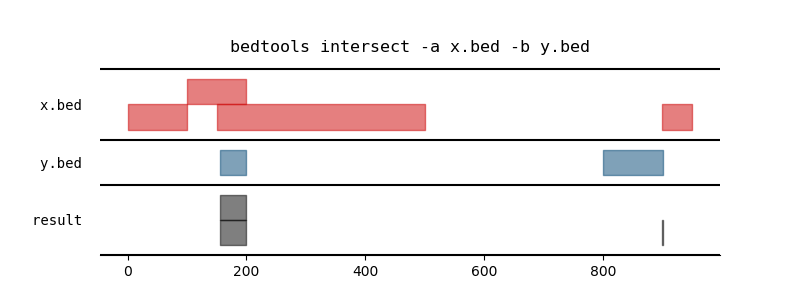
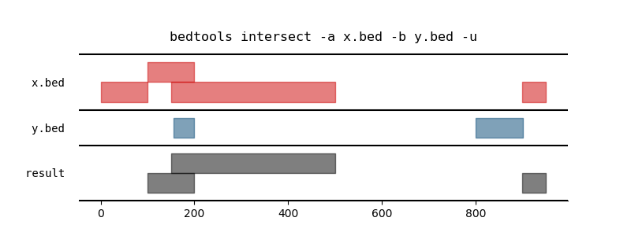
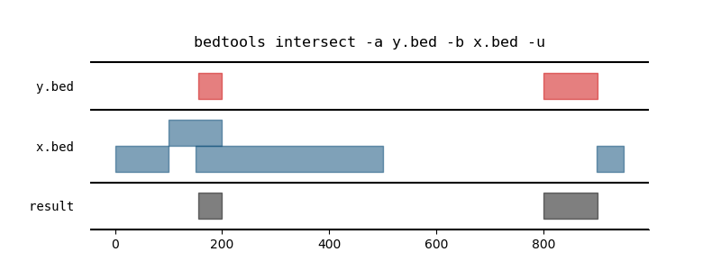
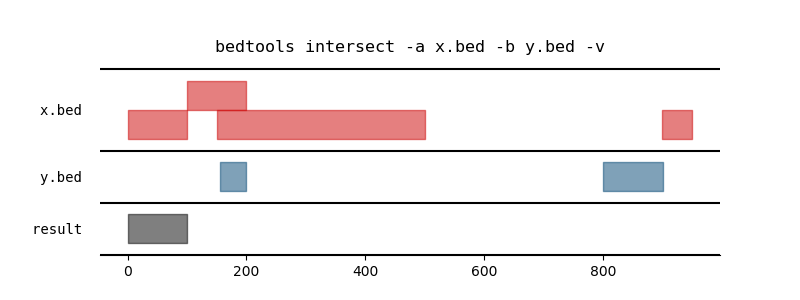
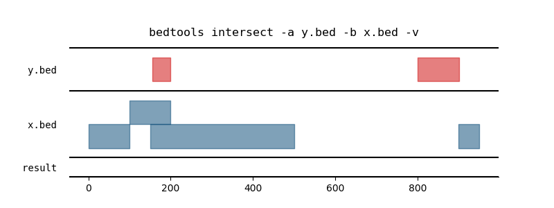
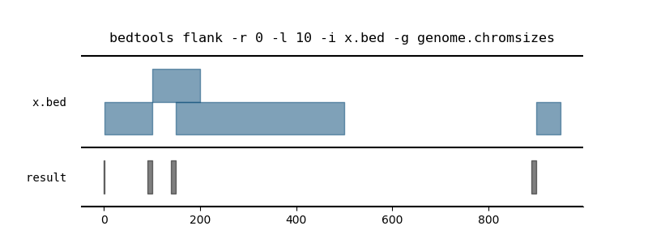
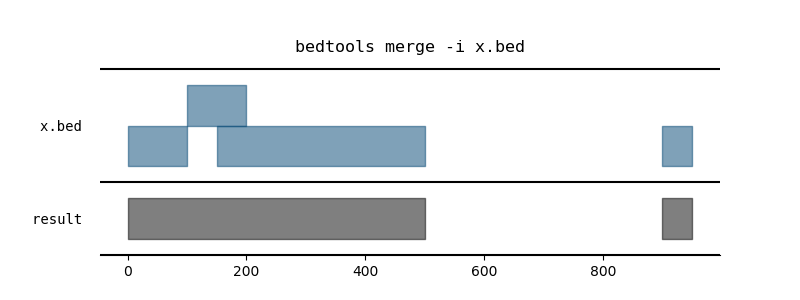
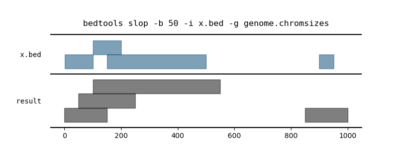
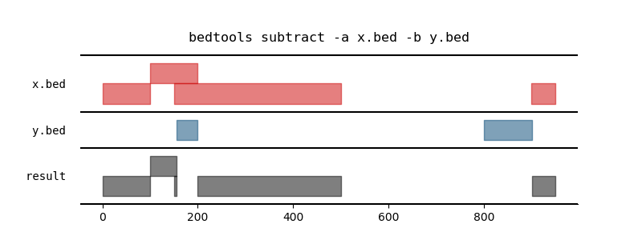

.. _integration:

Integration
===========
Today we will be working on data from
https://www.ncbi.nlm.nih.gov/pubmed/29241556. These data are from mouse,
looking at the effects of high-fat diet on gene expression (RNA-seq) and
histone modifications (H3K4me1, H3K4me3, H3K27ac).

We will:

- identify candidate intergenic enhancer regions
- identify differentially expressed genes that have enhancer marks nearby
- run a Fisher's exact test to see if differentially upregulated genes are
  enriched for nearby enhancer marks.
- run a Fisher's exact test to see if differentially upregulated genes are
  enriched for increased H3K4me3 at their promoters.

By the end of today, you will:

- Understand what BEDTools is used for and how to find help

- Recognize that BEDTools is just one command-line software tool and that
  it has lots of idiosyncracies, but it does have things in common with
  other tools.

- Be reminded of how to move data back and forth between helix and laptop: Here
  we will do all BEDTools ops on helix, all else on laptop.

- Understand the steps to integrate genomic regions described by *location*
  (here, histone mods identified by ChIP-seq) with experimental results
  described by *gene name* (here, differential expression results)

- Be able to follow a protocol for performing basic bioinformatics analyses
  using BEDTools and R

- Be reminded of how to plot with ggplot2 in R

- Know how to perform a Fisher's exact test in R and interpret the results

Preparation
-----------

Download example files
~~~~~~~~~~~~~~~~~~~~~~
These are data I've prepared ahead of time that we will be using today. You can
see how they were prepared `here
<https://github.com/lcdb/genomics-workshop-2018/blob/master/data/Snakefile>`_.

.. code-block:: bash

    wget https://github.com/lcdb/genomics-workshop-2018/raw/master/data/package.tar.gz
    tar -xf package.tar.gz

.. code-block:: bash

    wget -O - "https://www.ncbi.nlm.nih.gov/geo/download/?acc=GSE77625&format=file&file=GSE77625%5FmRNA%5FCD%5Fvs%5F16wkHFD%5FDESeq2%5Fresults%2Etxt%2Egz" > GSE77625.txt.gz

Introspection
~~~~~~~~~~~~~

Data are from this paper, published last month:
https://www.ncbi.nlm.nih.gov/pubmed/29241556. They used mm9 coordinates. To
save time, I've already lifted them over to mm10 coordinates.

The directory structure looks like this::

    ├── extra                           # directory of extra files I've created
    │   ├── mm10.chromsizes                 # "chromsizes" file for mm10
    │   ├── transcripts.bed                 # BED file of transcripts in mm10
    │   ├── genes.bed                       # BED file of genes in mm10
    │   ├── x.bed                           # example BED file for teaching
    │   └── y.bed                           # example BED file for teaching
    └── GSE77625                        # directory of files downloaded from GEO
        ├── GSE77625_h3k27ac_chow.bed       # H3K27ac domains in chow
        ├── GSE77625_h3k27ac_hfd.bed        # H3K27ac domains in HFD
        ├── GSE77625_h3k4me1_chow.bed       # H3K4me3 domains in chow
        ├── GSE77625_h3k4me1_hfd.bed        # H3K4me1 domains in HFD
        └── GSE77625_h3k4me3_chow.bed       # H3K4me3 domains in chow

Use `head` on each file. You can learn more about the BED format on the `UCSC
page <https://genome.ucsc.edu/FAQ/FAQformat.html#format1>`_.

If we look closely at the BED files from GEO, they are from the MACS peak caller::

    > head GSE77625/GSE77625_h3k4me3_chow.bed
    chr1    3670401 3672727 MACS_filtered_peak_1    1035.15
    chr1    4491528 4493999 MACS_filtered_peak_2    1440.85
    chr1    4571176 4572360 MACS_filtered_peak_3    1393.38
    chr1    4784173 4786416 MACS_filtered_peak_4    3100.00
    chr1    4807096 4809645 MACS_filtered_peak_5    3100.00
    chr1    4856979 4858869 MACS_filtered_peak_6    3100.00
    chr1    5017846 5021206 MACS_filtered_peak_7    3100.00
    chr1    5082648 5084029 MACS_filtered_peak_8    3100.00
    chr1    6213756 6215799 MACS_filtered_peak_9    3100.00
    chr1    6382408 6383469 MACS_filtered_peak_10   1113.67

Side note on the 5th column
---------------------------

What is that last column? After digging around on the GEO page, I found methods
info in one of the `sample pages for that GEO
entry <https://www.ncbi.nlm.nih.gov/geo/query/acc.cgi?acc=GSM2055366>`_. In the
"data processing section, they say they used MACS 1.4.0rc2. This is an old
version of MACS, but searching for it I found the `original site has
a README <http://liulab.dfci.harvard.edu/MACS/README.html>`_. At the end of that
README is a description of "Output files". It says::

    Output files

        NAME_peaks.xls is a tabular file which contains information about
        called peaks. You can open it in excel and sort/filter using excel
        functions. Information include: chromosome name, start position of
        peak, end position of peak, length of peak region, peak summit position
        related to the start position of peak region, number of tags in peak
        region, -10*log10(pvalue) for the peak region (e.g. pvalue is 1e-10,
        then this value should be 100), fold enrichment for this region against
        random Poisson distribution with local lambda, FDR in percentage.
        Coordinates in XLS is 1-based which is different with BED format.

        NAME_peaks.bed is BED format file which contains the peak
        locations. You can load it to UCSC genome browser or Affymetrix IGB
        software.

        NAME_summits.bed is in BED format, which contains the peak
        summits locations for every peaks. The 5th column in this file
        is the summit height of fragment pileup. If you want to find
        the motifs at the binding sites, this file is recommended.

I don't think they've converted ``NAME_peaks.xls``, because we don't have that
many columns. I don't think ``NAME_summits.bed`` is what we're looking at,
because I would expect that to be 1-bp peaks. Looking at our BED files, they
are definitely larger. I then downloaded the `tarball package of MACS
<https://github.com/downloads/taoliu/MACS/MACS-1.4.2-1.tar.gz>`_ unpacked it,
and read the README there. It was different! Near the bottom of that page,
I found this::

     2. NAME_peaks.bed is BED format file which contains the peak
     locations. You can load it to UCSC genome browser or Affymetrix IGB
     software. The 5th column in this file is the -10*log10pvalue of peak
     region.

     3. NAME_summits.bed is in BED format, which contains the peak summits
     locations for every peaks. The 5th column in this file is the summit
     height of fragment pileup. If you want to find the motifs at the
     binding sites, this file is recommended.

So I **think** that the 5th column is the -10*log10(pval) of each peak region.

Recap on data
-------------

Demonstrate that peaks (or domains since this is histone mod data) don't have
gene IDs::

    $ head GSE77625/GSE77625_h3k4me3_chow.bed
    chr1    3670401 3672727 MACS_filtered_peak_1    1035.15
    chr1    4491528 4493999 MACS_filtered_peak_2    1440.85
    chr1    4571176 4572360 MACS_filtered_peak_3    1393.38
    chr1    4784173 4786416 MACS_filtered_peak_4    3100.00
    chr1    4807096 4809645 MACS_filtered_peak_5    3100.00
    chr1    4856979 4858869 MACS_filtered_peak_6    3100.00
    chr1    5017846 5021206 MACS_filtered_peak_7    3100.00
    chr1    5082648 5084029 MACS_filtered_peak_8    3100.00
    chr1    6213756 6215799 MACS_filtered_peak_9    3100.00
    chr1    6382408 6383469 MACS_filtered_peak_10   1113.67

How many peaks are there? Which condition and which mark has the most peaks?

Demonstrate that the DESeq2 results don't have genomic coords::

    $ head GSE77625.txt
              baseMean          log2FoldChange     lfcSE               pvalue                 padj
    Serpina6  5895.82500928936  2.48928902278076   0.0545379886307599  0                      0
    Rhobtb1   3291.54687137     1.95276508740858   0.0611612877537507  1.08731956604379e-223  9.72389887912965e-220
    Saa4      21111.1219005361  2.96047167002528   0.123787400517557   2.09907006812668e-126  1.25146557461712e-122
    Asl       42410.5484534983  -1.72142049473088  0.0773954122626814  1.351328300561e-109    6.04246449595849e-106
    Bhlhe40   2310.29138629314  1.99643457257362   0.0910106893881505  1.17135999139523e-106  4.190188961219e-103
    Aacs      1422.67899510803  3.27241537853794   0.155903781676187   8.10004134319361e-98   2.41462232440602e-94
    Got1      14865.1943802654  -2.53245801431311  0.122703727971087   1.23073925012224e-94   3.14471460395519e-91
    Ccnd1     1305.62849727339  2.48414252966812   0.12291203459522    7.87666962994332e-91   1.76102641251458e-87
    Dact2     579.546268731826  -2.71692983532472  0.136127448792337   1.25892024134677e-88   2.50189415963648e-85

Is this by transcript or gene? How many lines? How many transcripts/genes?

Talk about the annoyances in this dataset:

- peaks are in mm9 coords
- DESeq2 output is keyed by gene symbol
- The R data packages that map gene ID to coordinate use Ensembl IDs, not symbol
- We need to map gene symbol to Ensembl ID, then use that new Ensembl ID to
  lookup the coordinates.
- Talk about transcripts and genes. What we want is a file of TSSes of
  transcripts for each gene, labeled by that gene.

I've done that ahead of time, so we can use the ``transcripts.bed`` file::

    $ head extra/transcripts.bed
    chr1    3205901 3216344 Xkr4    0       -       ENSMUST00000162897      ENSMUSG00000051951
    chr1    3206523 3215632 Xkr4    0       -       ENSMUST00000159265      ENSMUSG00000051951
    chr1    3214482 3671498 Xkr4    0       -       ENSMUST00000070533      ENSMUSG00000051951
    chr1    4343507 4360314 Rp1     0       -       ENSMUST00000027032      ENSMUSG00000025900
    chr1    4490928 4496413 Sox17   0       -       ENSMUST00000027035      ENSMUSG00000025902
    chr1    4491713 4496363 Sox17   0       -       ENSMUST00000116652      ENSMUSG00000025902
    chr1    4773206 4785710 Mrpl15  0       -       ENSMUST00000130201      ENSMUSG00000033845
    chr1    4773211 4785739 Mrpl15  0       -       ENSMUST00000156816      ENSMUSG00000033845
    chr1    4774436 4785698 Mrpl15  0       -       ENSMUST00000045689      ENSMUSG00000033845
    chr1    4776377 4785739 Mrpl15  0       -       ENSMUST00000115538      ENSMUSG00000033845

- Point to the snakefile needed to prep these data. It was more work to prep
  the data than it will be to do this analysis. Also point out that this is
  usually the case.

    - ``transcripts.bed`` has been created for you
    - BED files have been lifted over from mm9 to mm10
    - We don't need to lift over DESeq2 results. Why?

What is BEDTools?
-----------------
BEDTools is a "Swiss-army knife of tools for a wide-range of genomics analysis
tasks", especially "genome arithmetic".  Anything that has to do with genomic
coordinates (peaks, gene regions, genomic regions of any kind) can usually be
answered with BEDTools.

- bedtools docs: http://bedtools.readthedocs.io/en/latest/index.html
- extended tutorial: http://quinlanlab.org/tutorials/bedtools/bedtools.html

BEDTools in context
-------------------
BEDTools is one example of a command-line bioinformatics program. It runs on
Mac and Linux, but not Windows. Only way to use it is on the command line. (Why
do you think that is?). Hence needing to know how to get around in Bash.

Other command line tools align reads, extract sequences, count reads in
regions. Still others have companion web servers, though such sites often are
limited. BLAST, multiple alignment (clusal, muscle), HMMER are examples of
this.

Working at the command line puts you in the drivers seat, the same drivers seat
that other bioinformaticians and the tool authors themselves use.

Learning a new tool
-------------------
Learning a new tool is not trivial. You need to read the documentation (which
may be poor or non-existent), try to get it to run. Run it on some small test
data to get a feel for what it wants as input and what it wants as output.

Getting help (no args; ``-h``, and how this is a convention for arbitrary
programs)

For learning BEDTools, we'll briefly go through the commands. The point is not
for you to remember what command does what, but to get a feel for what *kinds
of things* it can do. Then the next time you run across a problem, you'll think
"that seems like something BEDTools could do" and that would give you a
starting point for your searches.

:Exercise: Which command could we use for getting upstream and downstream
           regions of each gene?

:Exercise: Assuming two files `tsses.bed` and `peaks.bed`, how would you
           get promoters with a peak 1kb upstream of TSSes?

Example data
------------

To get a feel for the BEDTools commands we'll be using, we will be using the
following example files:

.. code-block:: bash

    $ head data/extra/x.bed
    chr1    1       100     feature1
    chr1    100     200     feature2
    chr1    150     500     feature3
    chr1    900     950     feature4

.. code-block:: bash

    $ head data/extra/y.bed
    chr1    155     200
    chr1    800     901

Intersection is very common. However, note the number of regions we get back in
the result. What do you think is happening here?:

Using ``-u`` keeps things in ``a`` that intersect with ``b``:

Using ``-u`` is not symmetrical: it matters which file is provided as ``a`` and
which one as ``b``. Here we've switched them, and you can compare with the
previous results:

``-v`` means NOT. Here, "regions in ``a`` that do not intersect ``b``":

``-v`` is asymmetrical as well:

Here is one we can use for getting promoters. Note that a value of zero  (``-r
0``) does not report anything to the right. This is not actually in the
documentation, it is something discovered by experimenting on test files!

Merging demo:

Slop demo:

Subtract demo. This is often used for getting regions that are constituitively
intronic by subtracting exons from genes:

Working with real data
----------------------
When we have files with meaningful information in them, we can get interesting
regions. What does the following code do, in biologically-meaningful terms?

.. code-block:: bash

    bedtools intersect -a GSE77625/GSE77625_h3k4me1_chow.bed -b GSE77625/GSE77625_h3k27ac_chow.bed

These commands are about to get long. Here's the same command, but wrapped on
separate lines with a backslash. It's a way of formatting commands: bash will
glue the lines together. It's important to have the spaces right before the
backslashes!

.. code-block:: bash

    bedtools intersect \
      -a GSE77625/GSE77625_h3k4me1_chow.bed \
      -b GSE77625/GSE77625_h3k27ac_chow.bed

We need to name the output something useful so we can refer to it later. As we
will see, naming things can get surpisingly annoying.

Let's name the output ``enhancer-like_chow.bed``;

.. code-block:: bash

    bedtools intersect \
      -a GSE77625/GSE77625_h3k4me1_chow.bed \
      -b GSE77625/GSE77625_h3k27ac_chow.bed \
      > enhancer-like_chow.bed

If you haven't done so already, you should start a new file somewhere (on your
laptop, probably), and paste these commands into it to keep a record just like
we did in R.

Let's do some spot-checks. How many enhancer-like regions are there?

Given the data I've provided and the files we've just created, how do we get
intergenic enhancers in chow?

.. code-block:: bash

    bedtools intersect \
      -a enhancer-like_chow.bed \
      -b extra/transcripts.bed \
      -v \
      > intergenic_enhancer-like_chow.bed

This next one took some experimenting to get right. In the interest of time,
we're going to blindly copy this. If you're interested, you can look up the
arguments I'm using. I found them by carefully reading the BEDTools help for
closest, and then experimenting. Upon inspecting the output, I realized that
only chr1 was being output. I figured out that I needed to sort the data first.

.. code-block:: bash

    # Closest gene to each enhancer
    bedtools sort -i intergenic_enhancer-like_chow.bed > intergenic_enhancer-like_chow_sorted.bed
    bedtools sort -i extra/transcripts.bed > extra/transcripts_sorted.bed
    bedtools closest \
      -a intergenic_enhancer-like_chow_sorted.bed \
      -b extra/transcripts_sorted.bed \
      -D a \
      -io \
      -d \
      > closest_genes_to_enhancer_chow.bed

Now that you've run that command, inspect the output. The line for each
enhancer has been joined to the line for each gene. The last column is from the
``-d`` argument: it's the distance, in bp, from the gene to the enhancer.

.. code-block:: bash

    chr1  34386755  34388659  MACS_filtered_peak_47   770.33   chr1  34433121  34433199  Mir5103  0   -   ENSMUST00000175111  ENSMUSG00000092852  44463
    chr1  36063887  36068332  MACS_filtered_peak_54   2044.04  chr1  36068400  36106446  Hs6st1   0   +   ENSMUST00000088174  ENSMUSG00000045216  69
    chr1  36367345  36369782  MACS_filtered_peak_59   860.75   chr1  36307754  36324029  Arid5a   0   +   ENSMUST00000137906  ENSMUSG00000037447  -43317
    chr1  36469221  36471555  MACS_filtered_peak_61   1158.24  chr1  36471620  36508764  Cnnm4    0   +   ENSMUST00000153128  ENSMUSG00000037408  66
    chr1  37028693  37030146  MACS_filtered_peak_74   808.16   chr1  36792191  36939527  Tmem131  0   -   ENSMUST00000027290  ENSMUSG00000026116  -89167
    chr1  39590664  39591887  MACS_filtered_peak_94   881.62   chr1  39551296  39577405  Rnf149   0   -   ENSMUST00000062525  ENSMUSG00000048234  -13260
    chr1  40160658  40163450  MACS_filtered_peak_100  2067.60  chr1  40084768  40125219  Il1r2    0   +   ENSMUST00000027243  ENSMUSG00000026073  -35440
    chr1  40170632  40172992  MACS_filtered_peak_101  795.17   chr1  40084768  40125219  Il1r2    0   +   ENSMUST00000027243  ENSMUSG00000026073  -45414
    chr1  40221149  40224005  MACS_filtered_peak_102  1721.44  chr1  40225080  40316177  Il1r1    0   +   ENSMUST00000027241  ENSMUSG00000026072  1076
    chr1  51477080  51478548  MACS_filtered_peak_113  987.53   chr1  51749765  51916071  Myo1b    0   -   ENSMUST00000046390  ENSMUSG00000018417  271218

Get TSSes
---------

We have transcripts, but not TSSes. Here's how to get the single 1-bp position
just upstream of TSSes. How would you get 1kb upstream?

.. code-block:: bash

    bedtools flank \
      -l 1 \
      -r 0 \
      -s \
      -g extra/mm10.chromsizes \
      -i extra/transcripts.bed \
      > tsses.bed

Gained H3K27ac
--------------
It's not the best way to do it, but a first-pass way of getting differential
regions is to do the intersection between conditions.

We want to find the regions that are present in HFD, but not in chow. How would
you do this?

.. code-block:: bash

    bedtools intersect \
      -a GSE77625/GSE77625_h3k27ac_hfd.bed \
      -b GSE77625/GSE77625_h3k27ac_chow.bed \
      -v \
      > gained_h3k27ac.bed

The paper performed the differential region calling in a more robust way, and
found very few differential regions. How many did we get?

:Exercise: How would you further restrict gained H3K4me1 sites to only keep
           those that *also* have gained H3K27ac sites?

:Exercise: How would you get *lost* H3K4me1 sites? And those that also lost
           H3K27ac?

TSSes with gained H3K27ac
-------------------------
We have TSSes. We have gained H3K27ac. Now we can figure out which TSSes have
gained H3K27ac:

.. code-block:: bash

    bedtools intersect \
      -a tsses.bed \
      -b gained_h3k4me1.bed \
      -u \
      > tsses_with_gained_h3k4me1.bed

Move to R
---------

This will likely be on laptops. So we need to set up file transfer from helix.

See https://hpc.nih.gov/docs/transfer.html, we should require Filezilla to be
installed on laptops.

.. code-block:: r

    df <- read.table('GSE77625/GSE77625_chow-vs-HFD-deseq2_results.txt')
    gained <- read.table('tsses_with_gained_h3k4me1.bed')
    closest_to_en <- read.table('closest_genes_to_enhancer_chow.bed')

    head(df)
    head(gained)
    head(closest_to_en)

    df$gained <- FALSE
    df$gained[rownames(df) %in% gained$V4] <- TRUE

    df$closest_to_en <- FALSE
    df$closest_to_en[rownames(df) %in% closest_to_en$V9] <- TRUE

    df$up <- FALSE
    df$dn <- FALSE
    valid <- !is.na(df$padj)
    sig <- valid & df$padj < 0.1
    df[sig & df$log2FoldChange > 0, 'up'] <- TRUE
    df[sig & df$log2FoldChange < 0, 'dn'] <- TRUE

    table(df$up)
    table(df$dn)
    table(df$closest_to_en)

    # which genes went up AND gained h3k4me1?
    idx <- df$up & df$gained
    rownames(df)[idx]

    write.table(rownames(df)[idx], file='upregulated_that_gained_h3k4me1.txt', quote=FALSE, col.names=FALSE, row.names=FALSE)

    # do we want to go here? Maybe just demonstrate; this is a whole 'nother
    # workshop.
    library(ggplot2)
    ggplot(df) + aes(x=log2FoldChange) + geom_histogram(aes(y=..density..)) + facet_grid(gained~.)

    # up- or down-regulated foldchanges are no different in gained or not
    wilcox.test(df$log2FoldChange[df$gained & df$up], df$log2FoldChange[!df$gained & df$up])
    wilcox.test(df$log2FoldChange[df$gained & df$dn], df$log2FoldChange[!df$gained & df$dn])

    # both up- and downregulated genes are enriched for gain in H3K4me1.
    #
    fisher.test(
        matrix(
          c(
             sum(df$up & df$gained),
             sum(df$up & !df$gained),
             sum(!df$up & df$gained),
             sum(!df$up & !df$gained)
          ),
          nrow=2)
    )

    fisher.test(
        matrix(
          c(
             sum(df$dn & df$gained),
             sum(df$dn & !df$gained),
             sum(!df$dn & df$gained),
             sum(!df$dn & !df$gained)
          ),
          nrow=2)
    )
