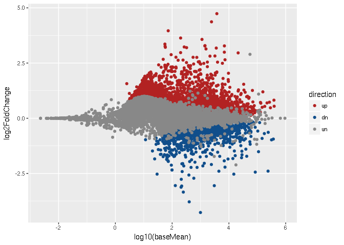
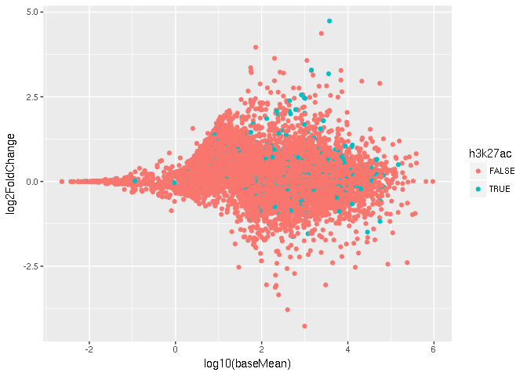
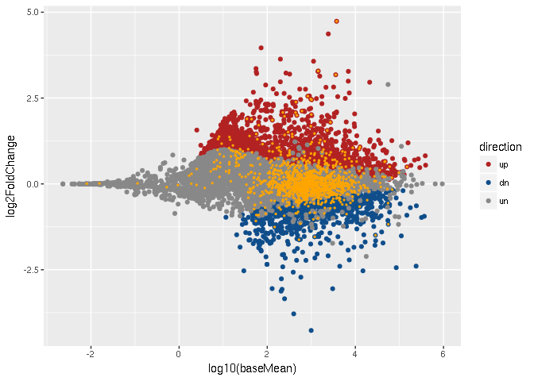
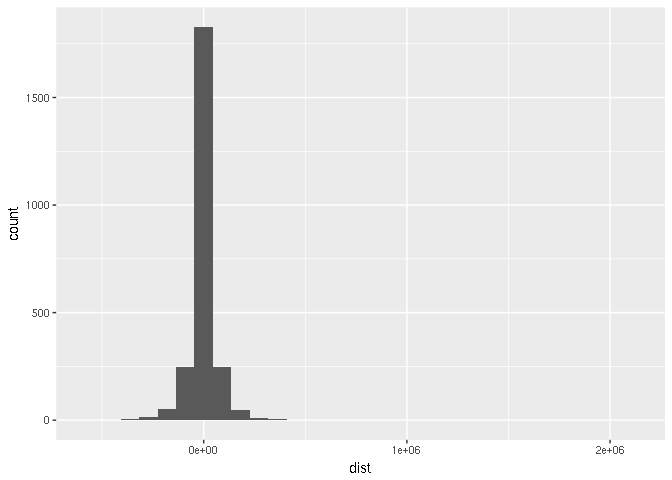

Ryan Dale  

# R component of "genomics tools"


## Comparing H3K27ac data with differential expression


Load the H3K27ac data:


```r
setwd('tmp/data')
h3k27ac <- read.table('tsses_with_gained_h3k27ac.bed')
head(h3k27ac)
```

```
##     V1       V2       V3     V4 V5 V6                 V7
## 1 chr1  4857813  4857814  Tcea1  0  + ENSMUST00000081551
## 2 chr1  4858037  4858038  Tcea1  0  + ENSMUST00000165720
## 3 chr1  9798129  9798130   Sgk3  0  + ENSMUST00000166384
## 4 chr1  9798129  9798130   Sgk3  0  + ENSMUST00000168907
## 5 chr1 13660546 13660547 Lactb2  0  - ENSMUST00000027071
## 6 chr1 16619312 16619313  Ube2w  0  - ENSMUST00000182554
##                   V8
## 1 ENSMUSG00000033813
## 2 ENSMUSG00000033813
## 3 ENSMUSG00000025915
## 4 ENSMUSG00000025915
## 5 ENSMUSG00000025937
## 6 ENSMUSG00000025939
```

This copies over some stuff from the ggplot part to add up/down genes, in case
we didn't get to it by this point. Otherwise, we could load the table created
from that analysis.


```r
setwd('tmp/data')
df <- read.table('GSE77625.txt')
head(df)
```

```
##           baseMean log2FoldChange      lfcSE        pvalue          padj
## Serpina6  5895.825       2.489289 0.05453799  0.000000e+00  0.000000e+00
## Rhobtb1   3291.547       1.952765 0.06116129 1.087320e-223 9.723899e-220
## Saa4     21111.122       2.960472 0.12378740 2.099070e-126 1.251466e-122
## Asl      42410.548      -1.721420 0.07739541 1.351328e-109 6.042464e-106
## Bhlhe40   2310.291       1.996435 0.09101069 1.171360e-106 4.190189e-103
## Aacs      1422.679       3.272415 0.15590378  8.100041e-98  2.414622e-94
```

```r
valid <- !is.na(df$padj) & !is.na(df$log2FoldChange)
sig <- df$padj < 0.1
up <- df$log2FoldChange > 0 & valid & sig
dn <- df$log2FoldChange < 0 & valid & sig
df[up, 'direction'] <- 'up'
df[dn, 'direction'] <- 'dn'
df[!(up | dn), 'direction'] <- 'un'
head(df)
```

```
##           baseMean log2FoldChange      lfcSE        pvalue          padj
## Serpina6  5895.825       2.489289 0.05453799  0.000000e+00  0.000000e+00
## Rhobtb1   3291.547       1.952765 0.06116129 1.087320e-223 9.723899e-220
## Saa4     21111.122       2.960472 0.12378740 2.099070e-126 1.251466e-122
## Asl      42410.548      -1.721420 0.07739541 1.351328e-109 6.042464e-106
## Bhlhe40   2310.291       1.996435 0.09101069 1.171360e-106 4.190189e-103
## Aacs      1422.679       3.272415 0.15590378  8.100041e-98  2.414622e-94
##          direction
## Serpina6        up
## Rhobtb1         up
## Saa4            up
## Asl             dn
## Bhlhe40         up
## Aacs            up
```

Similar to how we added a "direction" variable to the dataframe, let's add
a column indicating if a gene has H3K27ac at any of its TSSes. This uses the
``%in%`` operator. `x %in% y` gives a vector of TRUE or FALSE for every value
in `x` indicating if it is in `y` or not. We want to get a vector for every
gene in `df` which is TRUE where that gene's name is in the list of genes with
H3K27ac. Which column was that again?


```r
head(h3k27ac)
```

```
##     V1       V2       V3     V4 V5 V6                 V7
## 1 chr1  4857813  4857814  Tcea1  0  + ENSMUST00000081551
## 2 chr1  4858037  4858038  Tcea1  0  + ENSMUST00000165720
## 3 chr1  9798129  9798130   Sgk3  0  + ENSMUST00000166384
## 4 chr1  9798129  9798130   Sgk3  0  + ENSMUST00000168907
## 5 chr1 13660546 13660547 Lactb2  0  - ENSMUST00000027071
## 6 chr1 16619312 16619313  Ube2w  0  - ENSMUST00000182554
##                   V8
## 1 ENSMUSG00000033813
## 2 ENSMUSG00000033813
## 3 ENSMUSG00000025915
## 4 ENSMUSG00000025915
## 5 ENSMUSG00000025937
## 6 ENSMUSG00000025939
```
Ah, `V4`. So:


```r
has_h3k27ac <- rownames(df) %in% h3k27ac$V4
```

Spot checks . . . how many TRUE?


```r
table(has_h3k27ac)
```

```
## has_h3k27ac
## FALSE  TRUE 
## 22131  1096
```

Wait, how long was `h3k27ac`?


```r
nrow(h3k27ac)
```

```
## [1] 3431
```

Recall that we generated that H3K27ac data using trancript TSSes, so a gene can
show up multiple times. Since the DESeq2 results are at the gene level, we are
"collapsing" transcripts to genes by saying TRUE when *any* TSS of
a transcript has H3K27ac.

So we would hope that the number of *unique* genes in `h3k27ac$V4` is close to
the number of TRUE in `has_h3k27ac`:


```r
length(unique(h3k27ac$V4))
```

```
## [1] 1096
```

Great! Let's add the column to the dataframe so we can use it for plotting.


```r
df$h3k27ac <- has_h3k27ac
head(df)
```

```
##           baseMean log2FoldChange      lfcSE        pvalue          padj
## Serpina6  5895.825       2.489289 0.05453799  0.000000e+00  0.000000e+00
## Rhobtb1   3291.547       1.952765 0.06116129 1.087320e-223 9.723899e-220
## Saa4     21111.122       2.960472 0.12378740 2.099070e-126 1.251466e-122
## Asl      42410.548      -1.721420 0.07739541 1.351328e-109 6.042464e-106
## Bhlhe40   2310.291       1.996435 0.09101069 1.171360e-106 4.190189e-103
## Aacs      1422.679       3.272415 0.15590378  8.100041e-98  2.414622e-94
##          direction h3k27ac
## Serpina6        up   FALSE
## Rhobtb1         up   FALSE
## Saa4            up   FALSE
## Asl             dn   FALSE
## Bhlhe40         up   FALSE
## Aacs            up   FALSE
```

### Plotting

Here's the MA plot from the ggplot example:


```r
ggplot(df) +
    geom_point(mapping=aes(x=log10(baseMean), y=log2FoldChange, color=direction)) +
    scale_color_manual(
        values=c('un'='#888888', 'up'='firebrick', 'dn'='dodgerblue4'),
        limits=c('up', 'dn', 'un')
    )
```

```
## Warning: Removed 5273 rows containing missing values (geom_point).
```

<!-- -->

Now let's color by H3k27ac instead of direction.


```r
ggplot(df) +
    geom_point(mapping=aes(x=log10(baseMean), y=log2FoldChange, color=h3k27ac))
```

```
## Warning: Removed 5273 rows containing missing values (geom_point).
```

<!-- -->

Hmm, it looks like the TRUE ones are being hidden. Here is how we can plot
*layers* in ggplot, to make sure the TRUE gets plotted *after* the FALSE. The
key is in the `data=subset(...)` part for the geom:


```r
ggplot(df) +
    geom_point(data=subset(df, !df$h3k27ac), mapping=aes(x=log10(baseMean), y=log2FoldChange)) +
    geom_point(data=subset(df, df$h3k27ac),  mapping=aes(x=log10(baseMean), y=log2FoldChange), color='red')
```

```
## Warning: Removed 5267 rows containing missing values (geom_point).
```

```
## Warning: Removed 6 rows containing missing values (geom_point).
```

<!-- -->

It might be nice to combine the previous plots together:


```r
ggplot(df) +
    geom_point(mapping=aes(x=log10(baseMean), y=log2FoldChange, color=direction)) +
    scale_color_manual(
        values=c('un'='#888888', 'up'='firebrick', 'dn'='dodgerblue4'),
        limits=c('up', 'dn', 'un')
    ) +
    geom_point(
      data=subset(df, df$h3k27ac),
      mapping=aes(x=log10(baseMean), y=log2FoldChange),
      color='orange', size=.5)
```

```
## Warning: Removed 5273 rows containing missing values (geom_point).
```

```
## Warning: Removed 6 rows containing missing values (geom_point).
```

<!-- -->

### Fisher's exact tests

Let's assign some statistics to this. Are upregulated genes enriched for
H3K27ac in at least one of their TSSes?

R comes with a built-in Fisher's exact test. However, it is very particular
about how it wants the data to be provided. There are two ways of doing it;
here is the more verbose way (which is more explicit). We build the table that
follows the pattern:

```
         with_condition   without_condition
selected      .                   .
not           .                   .

```

Here's how to do that. Note that we're doing boolean operations, and then
taking the sum. That tells us how many TRUE. For example, `x` is TRUE wherever
both `df$direction == 'up'` is TRUE *and* `df$h3k27ac` is TRUE. So it's TRUE
wherever a gene went up AND has H3K27ac.


```r
x <- df$direction == 'up' & df$h3k27ac
```

And then we can get the *number* of upregulated genes that have H2K27ac:


```r
sum(x)
```

```
## [1] 259
```

Here is how to prepare the data for a Fisher's exact test:


```r
m <-matrix(
           c(
             sum(df$direction == 'up' & df$h3k27ac),
             sum(df$direction == 'up' & !df$h3k27ac),
             sum(df$direction != 'up' & df$h3k27ac),
             sum(df$direction != 'up' & !df$h3k27ac)
             ),
           nrow=2,
           dimnames=list(
                         c('up', 'not'),
                         c('h3k27ac', 'not')
                         )
           )
m
```

```
##     h3k27ac   not
## up      259   837
## not    2964 19167
```

Now that we have the data prepared, all we have to do is:


```r
fisher.test(m)
```

```
## 
## 	Fisher's Exact Test for Count Data
## 
## data:  m
## p-value < 2.2e-16
## alternative hypothesis: true odds ratio is not equal to 1
## 95 percent confidence interval:
##  1.724700 2.315724
## sample estimates:
## odds ratio 
##   2.000978
```

The odds ratio is greater than 1, which means the top-left corner of the table
is higher than you'd expect, given the other cells of the table. This is very
highly significant.

**Question:** How would we check if *downregulated* genes are enriched?

So we can conclude the following:

    "Genes upregulated under high-fat diet were enriched for gained H3K27ac at
    their promoters (p<2.2e-16, odds ratio 2.0, Fisher's exact test).

We also have all the numbers to calculate the various percentages:


```r
m
```

```
##     h3k27ac   not
## up      259   837
## not    2964 19167
```

```r
rowSums(m)
```

```
##    up   not 
##  1096 22131
```

```r
colSums(m)
```

```
## h3k27ac     not 
##    3223   20004
```

It turns out that the *downregulated* genes are *also* enriched for H3K27ac at
their promoters (though not quite as strongly). So it would be good to report
this as well.

**Importantly**, in the methods we would add the details about how we handled
genes and transcripts and how we defined "gain" of H3K27ac.

## Inspecting enhancer distances

This is an optional section in case we still have time.

### Load the closest transcript data


```r
setwd('tmp/data')
closest_transcripts <- read.table('closest_transcripts_to_enhancer_chow.bed')
```
Let's inspect what we brought in:


```r
head(closest_transcripts)
```

```
##     V1       V2       V3                    V4      V5   V6       V7
## 1 chr1 34386755 34388659 MACS_filtered_peak_47  770.33 chr1 34433121
## 2 chr1 36063887 36068332 MACS_filtered_peak_54 2044.04 chr1 36068400
## 3 chr1 36367345 36369782 MACS_filtered_peak_59  860.75 chr1 36307754
## 4 chr1 36469221 36471555 MACS_filtered_peak_61 1158.24 chr1 36471620
## 5 chr1 37028693 37030146 MACS_filtered_peak_74  808.16 chr1 36792191
## 6 chr1 39590664 39591887 MACS_filtered_peak_94  881.62 chr1 39551296
##         V8      V9 V10 V11                V12                V13    V14
## 1 34433199 Mir5103   0   - ENSMUST00000175111 ENSMUSG00000092852  44463
## 2 36106446  Hs6st1   0   + ENSMUST00000088174 ENSMUSG00000045216    -69
## 3 36324029  Arid5a   0   + ENSMUST00000137906 ENSMUSG00000037447  43317
## 4 36508764   Cnnm4   0   + ENSMUST00000153128 ENSMUSG00000037408    -66
## 5 36939527 Tmem131   0   - ENSMUST00000027290 ENSMUSG00000026116 -89167
## 6 39577405  Rnf149   0   - ENSMUST00000062525 ENSMUSG00000048234 -13260
```

No header. Notice how R adds ``V*`` column names if there's no header. One
option would be to manually type in a header row. However, for now we just want
the distance (``V14``), and the gene symbol (``V9``).


```r
closest_transcripts <- closest_transcripts[, c('V9', 'V14')]
head(closest_transcripts)
```

```
##        V9    V14
## 1 Mir5103  44463
## 2  Hs6st1    -69
## 3  Arid5a  43317
## 4   Cnnm4    -66
## 5 Tmem131 -89167
## 6  Rnf149 -13260
```

```r
colnames(closest_transcripts) <- c('gene', 'dist')
head(closest_transcripts)
```

```
##      gene   dist
## 1 Mir5103  44463
## 2  Hs6st1    -69
## 3  Arid5a  43317
## 4   Cnnm4    -66
## 5 Tmem131 -89167
## 6  Rnf149 -13260
```

### Basic plotting
- How far away are these enhancers from genes, on average?
 - What kind of plot is appropriate for this?


```r
library(ggplot2)
ggplot(closest_transcripts) +
    aes(x=dist) +
    geom_histogram()
```

```
## `stat_bin()` using `bins = 30`. Pick better value with `binwidth`.
```

<!-- -->

Looks like there's something pretty far away. What gene is it?


```r
# order small to large. Recall we have negative distances, but the one we're
# trying to find is positive. So we want the last thing.
o <- order(closest_transcripts$dist)
tail(o)
```

```
## [1] 2444 2445  530  531 1083 1581
```

```r
closest_transcripts[tail(o),]
```

```
##          gene    dist
## 2444     Bcor  370625
## 2445     Bcor  370625
## 530   Rnf144a  479458
## 531   Rnf144a  479458
## 1083 Tmem200c  540556
## 1581    Ttll7 2099204
```

Hmm. Looks like ``Ttll7`` is the farthest. But why are there repeats of
``Bcor`` and ``Rnf144a``?

Remember the `transcripts.bed` file? It had all transcripts of all genes. If
multiple transcripts have the same TSS, *and* an enhancer is upstream of that
transcript (say 10kb away), then we will get multiple hits for that gene. So we
need to interpret these results as "number of **transcripts**.

Just to demonstrate, here's the same thing we just did, but now including the
Ensembl transcript ID so we can verify that those genes are repeated because
they are different transcripts:


```r
setwd('tmp/data')
demo <- read.table('closest_transcripts_to_enhancer_chow.bed')
demo <- demo[, c('V9', 'V12', 'V14')]
colnames(demo) <- c('gene', 'transcript', 'dist')
o <- order(demo$dist)
tail(o)
```

```
## [1] 2444 2445  530  531 1083 1581
```

```r
demo[tail(o),]
```

```
##          gene         transcript    dist
## 2444     Bcor ENSMUST00000115513  370625
## 2445     Bcor ENSMUST00000124033  370625
## 530   Rnf144a ENSMUST00000062149  479458
## 531   Rnf144a ENSMUST00000020971  479458
## 1083 Tmem200c ENSMUST00000178545  540556
## 1581    Ttll7 ENSMUST00000037942 2099204
```
