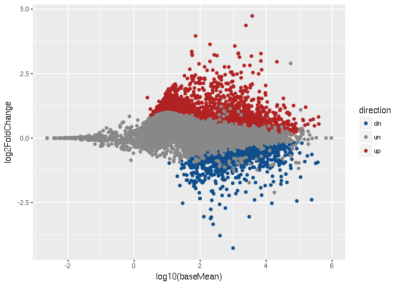
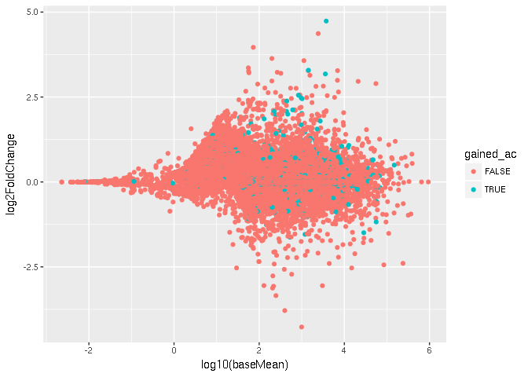
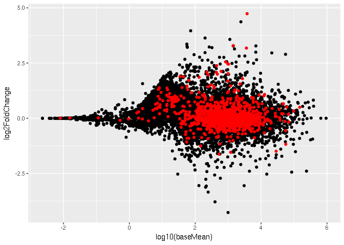
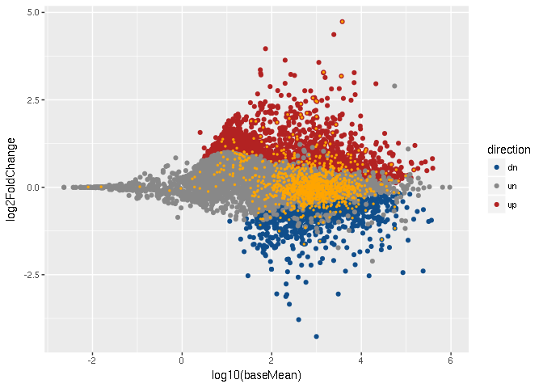
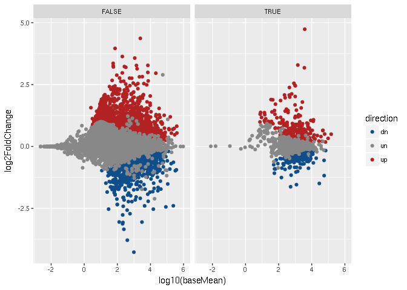
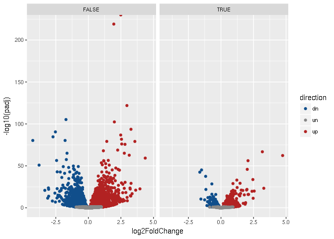

## Download data

```
wget https://github.com/lcdb/genomics-workshop-2018/raw/master/extras/bedtools-and-deseq.tsv
```

## Load and inspect


```r
# if downloaded separately:
# df <- read.table('bedtools-and-deseq.tsv')

# For the purposes of reproductibility:
df <- read.table('https://github.com/lcdb/genomics-workshop-2018/raw/master/extras/bedtools-and-deseq.tsv')
head(df)
```

```
##           baseMean log2FoldChange      lfcSE        pvalue          padj
## Serpina6  5895.825       2.489289 0.05453799  0.000000e+00  0.000000e+00
## Rhobtb1   3291.547       1.952765 0.06116129 1.087320e-223 9.723899e-220
## Saa4     21111.122       2.960472 0.12378740 2.099070e-126 1.251466e-122
## Asl      42410.548      -1.721420 0.07739541 1.351328e-109 6.042464e-106
## Bhlhe40   2310.291       1.996435 0.09101069 1.171360e-106 4.190189e-103
## Aacs      1422.679       3.272415 0.15590378  8.100041e-98  2.414622e-94
##          direction gained_ac     gene
## Serpina6        up     FALSE Serpina6
## Rhobtb1         up     FALSE  Rhobtb1
## Saa4            up     FALSE     Saa4
## Asl             dn     FALSE      Asl
## Bhlhe40         up     FALSE  Bhlhe40
## Aacs            up     FALSE     Aacs
```

```r
nrow(df)
```

```
## [1] 23227
```

```r
ncol(df)
```

```
## [1] 8
```

```r
dim(df)
```

```
## [1] 23227     8
```

## Inspection

How many up/down/unchanged genes?


```r
head(df$direction == 'up')
```

```
## [1]  TRUE  TRUE  TRUE FALSE  TRUE  TRUE
```

```r
sum(df$direction == 'up')
```

```
## [1] 3223
```

```r
sum(df$direction == 'dn')
```

```
## [1] 2691
```

Percent up/down:


```r
sum(df$direction == 'up') / nrow(df)
```

```
## [1] 0.1387609
```

```r
sum(df$direction == 'dn') / nrow(df)
```

```
## [1] 0.1158565
```

How to get number of genes with gained H3K27ac?

## Plotting


```r
library(ggplot2)
```


```r
ggplot(df) + geom_point(mapping=aes(x=baseMean, y=log2FoldChange))
```

```
## Warning: Removed 5273 rows containing missing values (geom_point).
```

<!-- -->

We should put `baseMean` on a log scale:


```r
ggplot(df) + geom_point(mapping=aes(x=log10(baseMean), y=log2FoldChange))
```

```
## Warning: Removed 5273 rows containing missing values (geom_point).
```

<!-- -->

Let's color by direction:


```r
ggplot(df) + geom_point(mapping=aes(x=log10(baseMean), y=log2FoldChange, color=direction))
```

```
## Warning: Removed 5273 rows containing missing values (geom_point).
```

<!-- -->

Heres a nicer way of coloring:


```r
ggplot(df) + geom_point(mapping=aes(x=log10(baseMean), y=log2FoldChange, color=direction)) +
    scale_color_manual(
        values=c('un'='#888888', 'up'='firebrick', 'dn'='dodgerblue4')
    )
```

```
## Warning: Removed 5273 rows containing missing values (geom_point).
```

<!-- -->

Now let's color by H3k27ac instead of direction.


```r
ggplot(df) +
    geom_point(mapping=aes(x=log10(baseMean), y=log2FoldChange, color=gained_ac))
```

```
## Warning: Removed 5273 rows containing missing values (geom_point).
```

<!-- -->

Hmm, it looks like the TRUE ones are being hidden. Here is how we can plot
*layers* in ggplot, to make sure the TRUE gets plotted *after* the FALSE. The
key is in the `data=subset(...)` part for the geom:


```r
ggplot(df, mapping=aes(x=log10(baseMean), y=log2FoldChange)) +
    geom_point(data=subset(df, !df$gained_ac)) +
    geom_point(data=subset(df, df$gained_ac), color='red')
```

```
## Warning: Removed 5267 rows containing missing values (geom_point).
```

```
## Warning: Removed 6 rows containing missing values (geom_point).
```

<!-- -->

It might be nice to combine the previous plots together:


```r
ggplot(df, mapping=aes(x=log10(baseMean), y=log2FoldChange)) +
    geom_point(mapping=aes(color=direction)) +
    scale_color_manual(
        values=c('un'='#888888', 'up'='firebrick', 'dn'='dodgerblue4')) +
    geom_point(
      data=subset(df, df$gained_ac),
      color='orange', size=.5)
```

```
## Warning: Removed 5273 rows containing missing values (geom_point).
```

```
## Warning: Removed 6 rows containing missing values (geom_point).
```

<!-- -->

Or facet it:


```r
ggplot(df, mapping=aes(x=log10(baseMean), y=log2FoldChange)) +
    geom_point(mapping=aes(color=direction)) +
    scale_color_manual(
        values=c('un'='#888888', 'up'='firebrick', 'dn'='dodgerblue4')) +
    facet_wrap(~gained_ac)
```

```
## Warning: Removed 5273 rows containing missing values (geom_point).
```

<!-- -->

Or a volcano plot:


```r
ggplot(df, mapping=aes(x=log2FoldChange, y=-log10(padj))) +
    geom_point(mapping=aes(color=direction)) +
    scale_color_manual(
        values=c('un'='#888888', 'up'='firebrick', 'dn'='dodgerblue4')) +
    geom_point(
      data=subset(df, df$gained_ac),
      color='orange', size=.5)
```

```
## Warning: Removed 5341 rows containing missing values (geom_point).
```

```
## Warning: Removed 6 rows containing missing values (geom_point).
```

<!-- -->


```r
ggplot(df, mapping=aes(x=log2FoldChange, y=-log10(padj))) +
    geom_point(mapping=aes(color=direction)) +
    scale_color_manual(
        values=c('un'='#888888', 'up'='firebrick', 'dn'='dodgerblue4')) +
    facet_wrap(~gained_ac)
```

```
## Warning: Removed 5341 rows containing missing values (geom_point).
```

<!-- -->
