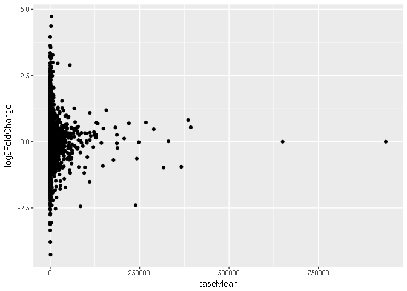
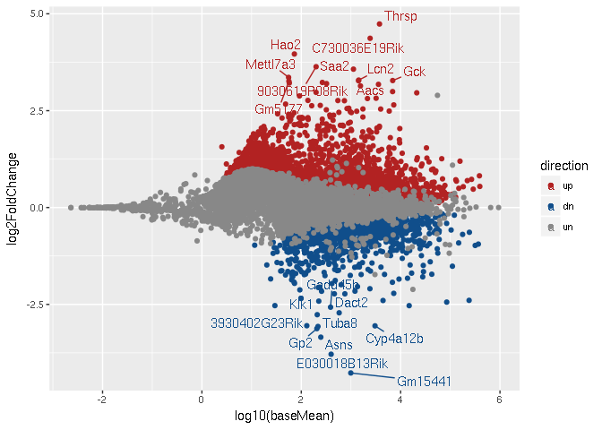
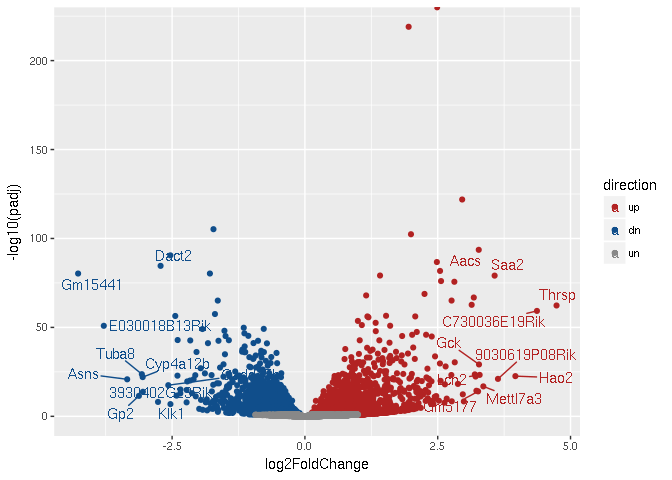
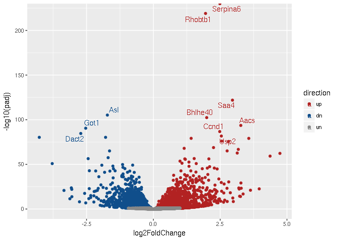
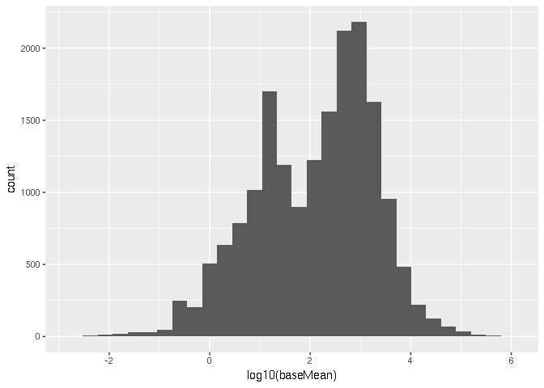
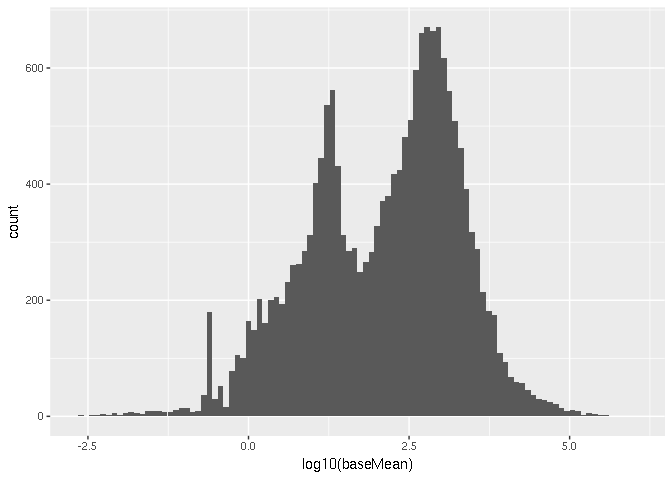
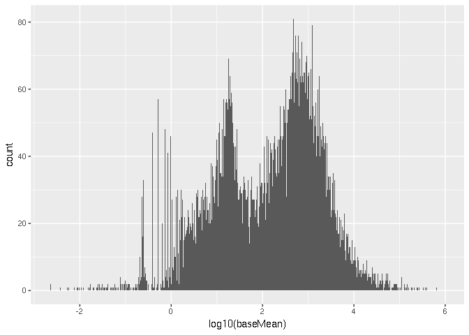
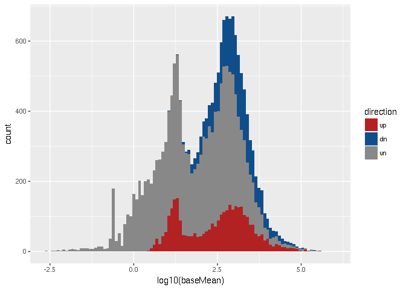

# DESeq2 plotting
Ryan Dale  

First, either run the following command in a terminal on the machine running R,
or save the URL as "GSE77625.txt.gz":

```
wget -O - "https://www.ncbi.nlm.nih.gov/geo/download/?acc=GSE77625&format=file&file=GSE77625%5FmRNA%5FCD%5Fvs%5F16wkHFD%5FDESeq2%5Fresults%2Etxt%2Egz" > GSE77625.txt.gz
```

Load ggplot2, load the data, and inspect it:


```r
library(ggplot2)
df <- read.table('GSE77625.txt.gz', header=TRUE, stringsAsFactors=FALSE)
head(df)
```

```
##           baseMean log2FoldChange      lfcSE        pvalue          padj
## Serpina6  5895.825       2.489289 0.05453799  0.000000e+00  0.000000e+00
## Rhobtb1   3291.547       1.952765 0.06116129 1.087320e-223 9.723899e-220
## Saa4     21111.122       2.960472 0.12378740 2.099070e-126 1.251466e-122
## Asl      42410.548      -1.721420 0.07739541 1.351328e-109 6.042464e-106
## Bhlhe40   2310.291       1.996435 0.09101069 1.171360e-106 4.190189e-103
## Aacs      1422.679       3.272415 0.15590378  8.100041e-98  2.414622e-94
```

Let's start off with an MA plot, a common tool for examining RNA-seq
differential expression results.


```r
ggplot(df) +
    geom_point(mapping=aes(x=baseMean, y=log2FoldChange))
```

```
## Warning: Removed 5273 rows containing missing values (geom_point).
```

<!-- -->

We get a warning that rows containing missing values were removed. This is OK
-- in DESeq2 output, outlier genes will have their log2FoldChange set to NA.
ggplot2 automatically removes those genes from the plot.

The `baseMean` values are not on a log scale. Here's how to use a log10 scale
for the x axis:


```r
ggplot(df) +
  # was:
  # geom_point(mapping=aes(x=baseMean, y=log2FoldChange))
    geom_point(mapping=aes(x=log10(baseMean), y=log2FoldChange))
```

```
## Warning: Removed 5273 rows containing missing values (geom_point).
```

<!-- -->

We'd like to color by up, down, and unchanged. To do that, we need columns in
our dataframe indicating that. We also need to handle NAs in our dataset.
DESeq2 reports NAs for cases where genes are too low counts or outliers.


```r
# TRUE where padj and log2FoldChange are not NA
valid <- !is.na(df$padj) & !is.na(df$log2FoldChange)

# TRUE where padj less than 0.1
sig <- df$padj < 0.1

# TRUE where logfoldchange is positive AND valid is TRUE AND sig is TRUE
up <- df$log2FoldChange > 0 & valid & sig

# TRUE where logfoldchange is negative AND valid is TRUE AND sig is TRUE
dn <- df$log2FoldChange < 0 & valid & sig

# new column, direction. Wherever up is TRUE, set direction to 'up'
df[up, 'direction'] <- 'up'

# Wherever dn is TRUE, set direction to 'dn'
df[dn, 'direction'] <- 'dn'

# Wherever neither are true, set direction to 'un'
df[!(up | dn), 'direction'] <- 'un'
```

Check `df` to make sure we have that new column:


```r
head(df)
```

```
##           baseMean log2FoldChange      lfcSE        pvalue          padj
## Serpina6  5895.825       2.489289 0.05453799  0.000000e+00  0.000000e+00
## Rhobtb1   3291.547       1.952765 0.06116129 1.087320e-223 9.723899e-220
## Saa4     21111.122       2.960472 0.12378740 2.099070e-126 1.251466e-122
## Asl      42410.548      -1.721420 0.07739541 1.351328e-109 6.042464e-106
## Bhlhe40   2310.291       1.996435 0.09101069 1.171360e-106 4.190189e-103
## Aacs      1422.679       3.272415 0.15590378  8.100041e-98  2.414622e-94
##          direction
## Serpina6        up
## Rhobtb1         up
## Saa4            up
## Asl             dn
## Bhlhe40         up
## Aacs            up
```

How many up/down/unchanged do we have?


```r
sum(up)
```

```
## [1] 3223
```

```r
sum(dn)
```

```
## [1] 2691
```

```r
sum(!(up | dn))
```

```
## [1] 17313
```

Now we can use that new column as the color in our aesthetic mapping:


```r
ggplot(df) +

  # was:
  # geom_point(mapping=aes(x=log10(baseMean), y=log2FoldChange))
    geom_point(mapping=aes(x=log10(baseMean), y=log2FoldChange, color=direction))
```

```
## Warning: Removed 5273 rows containing missing values (geom_point).
```

<!-- -->

Here's how to get nicer colors:


```r
ggplot(df) +
    geom_point(mapping=aes(x=log10(baseMean), y=log2FoldChange, color=direction)) +

    # add manual color scale. limits indicates the order in which they appear
    # in the legend
    scale_color_manual(
        values=c('un'='#888888', 'up'='firebrick', 'dn'='dodgerblue4'),
        limits=c('up', 'dn', 'un')
    )
```

```
## Warning: Removed 5273 rows containing missing values (geom_point).
```

<!-- -->

Label the 10 highest and lowest genes. For this, we need an extra package
called "ggrepel".


```r
# install.packages('ggrepel', repos='http://cran.us.r-project.org')
library(ggrepel)
```


```r
# get lists of top and bottom genes
highest <- rownames(df) %in% rownames(df)[order(df$log2FoldChange, decreasing=TRUE)][1:10]
lowest <- rownames(df) %in% rownames(df)[order(df$log2FoldChange, decreasing=FALSE)][1:10]

# In order to provide data to the labeling, the labels have to be a column in
# the dataframe. So we create a new column called "gene":
df$gene <- rownames(df)

# geom_text_repel needs x and y mappings. In order to recycle those mappings
# across geom_point and geom_text_repel, we pull out the aes() out from
# geom_point.

ggplot(df) +
  # was:
  # geom_point(mapping=aes(x=log10(baseMean), y=log2FoldChange, color=direction)) +
    aes(x=log10(baseMean), y=log2FoldChange, color=direction) +
    geom_point() +
    scale_color_manual(
        values=c('un'='#888888', 'up'='firebrick', 'dn'='dodgerblue4'),
        limits=c('up', 'dn', 'un')
    ) +

  # This is how we provide which things should be labeled. The highest:
    geom_text_repel(
        data=subset(df, highest),
        aes(label=gene)) +

  # and the lowest:
    geom_text_repel(
        data=subset(df, lowest),
        aes(label=gene))
```

```
## Warning: Removed 5273 rows containing missing values (geom_point).
```

<!-- -->

A volcano plot is another commonly-used way of plotting differential expression
data.


```r
ggplot(df) +
  # was:
  # aes(x=log10(baseMean), y=log2FoldChange, color=direction) +
    aes(x=log2FoldChange,  y=-log10(padj),   color=direction) +
    geom_point() +
    scale_color_manual(
        values=c('un'='#888888', 'up'='firebrick', 'dn'='dodgerblue4'),
        limits=c('up', 'dn', 'un')
    ) +
    geom_text_repel(
        data=subset(df, highest),
        aes(label=gene)) +
    geom_text_repel(
        data=subset(df, lowest),
        aes(label=gene))
```

```
## Warning: Removed 5341 rows containing missing values (geom_point).
```

<!-- -->

Perhaps we care more about the best pval, not the best log2foldchange:


```r
best_pval <- rownames(df) %in% rownames(df)[order(df$padj, decreasing=FALSE)][1:10]
ggplot(df) +
  # was:
  # aes(x=log10(baseMean), y=log2FoldChange, color=direction) +
    aes(x=log2FoldChange,  y=-log10(padj),   color=direction) +
    geom_point() +
    scale_color_manual(
        values=c('un'='#888888', 'up'='firebrick', 'dn'='dodgerblue4'),
        limits=c('up', 'dn', 'un')
    ) +
    geom_text_repel(
      # was:
      # data=subset(df, highest),
        data=subset(df, best_pval),

        aes(label=gene))
```

```
## Warning: Removed 5341 rows containing missing values (geom_point).
```

<!-- -->

## Histograms

By changing geoms and aesthetics, we can get histograms:


```r
ggplot(df) +

  # was:
  # aes(x=log2FoldChange, y=-log10(padj), color=direction) +
    aes(x=log10(baseMean)) +

  # was:
  # geom_point()
    geom_histogram()
```

```
## `stat_bin()` using `bins = 30`. Pick better value with `binwidth`.
```

```
## Warning: Removed 5273 rows containing non-finite values (stat_bin).
```

<!-- -->

Generally when we're plotting large numbers of things (here, thousands of
genes) we can increase the number of bins to get higher resolution:


```r
ggplot(df) +
    aes(x=log10(baseMean)) +
  # was:
  # geom_histogram()
    geom_histogram(bins=100)
```

```
## Warning: Removed 5273 rows containing non-finite values (stat_bin).
```

<!-- -->

This might be too much though, it looks too noisy:


```r
ggplot(df) +
    aes(x=log10(baseMean)) +
  # was:
  # geom_histogram(bins=100)
    geom_histogram(bins=1000)
```

```
## Warning: Removed 5273 rows containing non-finite values (stat_bin).
```

<!-- -->

Let's go back to 100, and divide the baseMean by whether genes went up or down.
Note we're using "fill" instead of "color". Why?


```r
ggplot(df) +
  # was: 
  # aes(x=log10(baseMean)) +
    aes(x=log10(baseMean), fill=direction) +

    geom_histogram(bins=100) +

    # add colors
    scale_fill_manual(
        values=c('un'='#888888', 'up'='firebrick', 'dn'='dodgerblue4'),
        limits=c('up', 'dn', 'un')
    )
```

```
## Warning: Removed 5273 rows containing non-finite values (stat_bin).
```

<!-- -->

These are overlapping, how do we split them?


```r
ggplot(df) +
    aes(x=log10(baseMean), fill=direction) +
    geom_histogram(bins=100) +
    scale_fill_manual(
        values=c('un'='#888888', 'up'='firebrick', 'dn'='dodgerblue4'),
        limits=c('up', 'dn', 'un')
    ) +

    # add faceting
    facet_grid(direction~.)
```

```
## Warning: Removed 5273 rows containing non-finite values (stat_bin).
```

<!-- -->

## Save file for later

Later, we'll be integrating these results with some ChIP-seq data, and we'll
want up/downregulated genes for that. Let's save the current data frame for
later use:


```r
write.table(df, file='deseq_results_edited.tsv', sep='\t')
```
