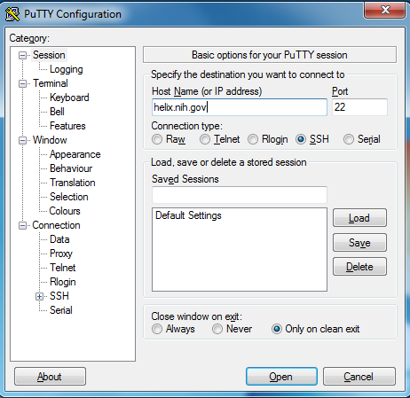
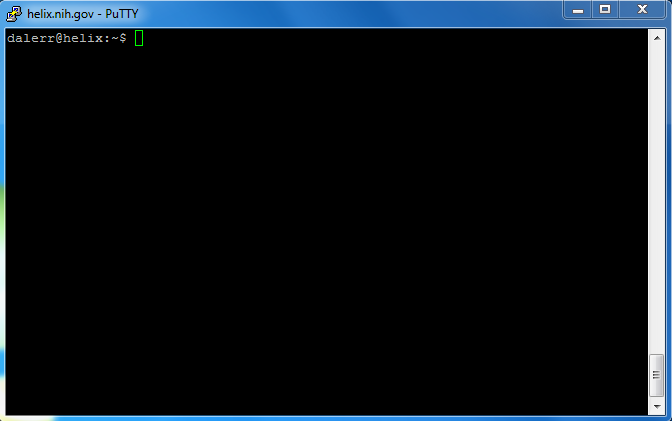

Setup
=====

We will be using Helix (https://hpc.nih.gov/) for our command-line work. This
is a machine in Bldg 12 running Linux. It has 128 cores and 1 TB of RAM. It can
be used by anyone at NIH. Tens of users are logged in at any one time. It is
intended for interactive use and relatively small jobs. One user can take up
to 8 CPUs and 100 GB RAM. If you go over this, you should use the Biowulf
cluster, otherwise you will get emails from the Helix staff!

Using Helix minimizes the effort you need to be productive on the command line.
A huge headache with bioinformatics is installation, but Helix has lots of
bioinformatics software is already installed (https://hpc.nih.gov/apps).
Windows, Mac, and Linux users can all connect to the same machine and we know
the software will be installed. The alternative would be working with each
person individually for a long time to get everything installed.

However, for our R work, we will be using RStudio on laptops -- not on Helix.
This is because R is used in fields other than Linux-heavy bioinformatics, and
has great support for other platforms. There are also good technical reasons
for using R on laptops (e.g., X11 forwarding with 30 people will get sluggish),
and we won't be doing anything CPU-intensive during this workshop.

Connecting to Helix
===================

In order to give commands to Helix, we need to connect to the machine. This is
done differently depending on your platform. MacOS comes with many of the tools
we need, but Windows does not. In the end, we are connected when we see
a terminal window with ``username@helix.nih.gov:~$``.

Connect to Helix from MacOS
---------------------------
On Mac, open the Terminal app which comes already installed. This should be in
your Applications folder. You might want to pin it to your dock so it's easier
to access later.

In the terminal, type this, where ``username`` is your user name on Helix if
you have one, otherwise it's the student account that we provided you::

    ssh username@helix.nih.gov

You will be prompted for a password, which is your NIH password (if you have
a Helix account) or otherwise the student account credentials we provided. You
will NOT see any text being entered, not even ``***``. Just type your password
and hit Enter.

You are connected when you see a terminal window with
``username@helix.nih.gov:~$``.

Connect to Helix from Windows
-----------------------------

On Windows, open PuTTY. In the "Host Name (or IP address)" text box, type
``helix.nih.gov``. This is the address of the machine you want to connect to.
Leave everything else as default.

Then click the "Open" button.

You will be prompted for your username.

**If you already have a helix account, use that. It is your normal NIH username
and password**. Otherwise, use the student account we have provided you.

As you type the password, nothing may show up. This is normal and expected.
Just type it and hit Enter. Once you are logged in, you will get a lot of text
explaining how this is a government system.

For this workshop, the font and colors will look different from what you see on
the Mac used by the instructors.
